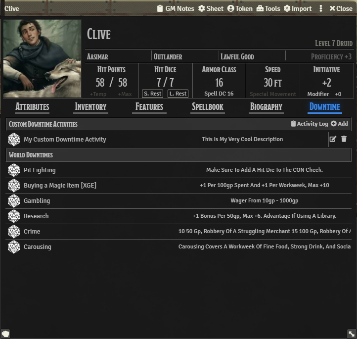
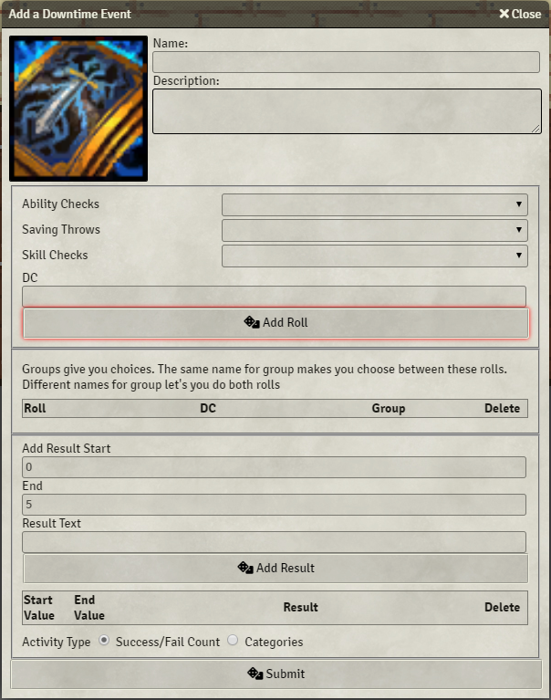
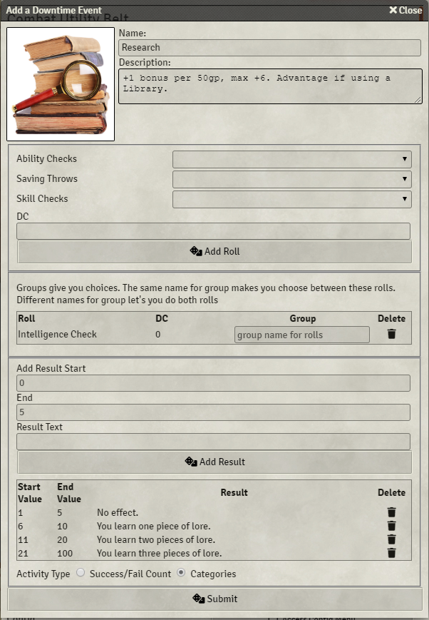
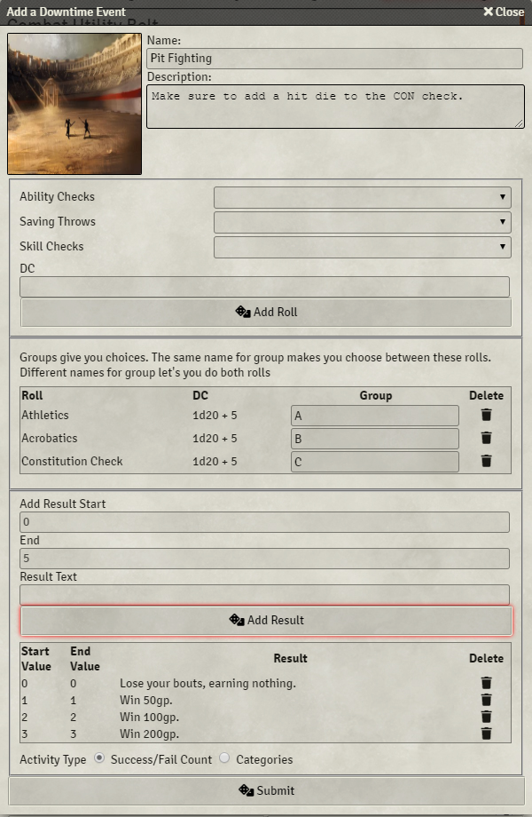
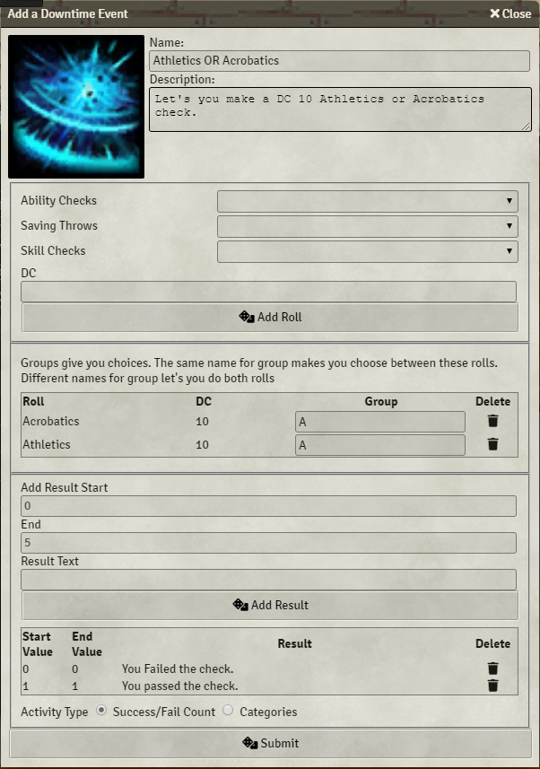
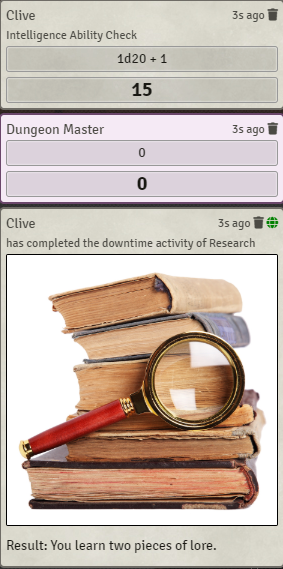

# Ethck's 5e Downtime Tracking

## Summary
Ethck's 5e Downtime Tracking allows you to create a series of rolls with predefined DCs that represent
downtime activities as detailed in Xanathar's Guide to Everything.

## How to Use
### Overview

Downtime activities come in two different forms: local and global. Local downtimes are on a per actor
basis and will not be shown in other actor's downtime tabs. Global downtimes will appear in every actor's
downtime tabs. Local downtimes can be configured directly in the actor's character sheet, but global
downtimes will need to be configured by a Gamemaster in the module settings page.
### Adding a Downtime Activity

Adding a downtime is straightforward, you simply just have to fill in all of the blanks! If you want to
add a roll to your downtime, just select a roll to make out of the available options, add a DC, and hit
the "Add Roll" button. The DC can be a number, or it can even be a formula. If you want to add a result
that is automatically displayed in chat after the roll, just provide a start and end amount
(# of successful checks, or value based for categories) and click on the "Add Result" button.
### Types of Downtimes
#### Category Downtime

A Category downtime does not take into account whether or not a roll passes the DC, but rather
determines what "tier" is obtained by the roll. For instance, in the above downtime the 
Intelligence check is broken into multiple different categories that yield different amounts
of lore depending on the roll made. A roll of 21+ yields 3 lore, but a roll of 5 yields nothing.
#### AND Downtime

AND rolls are made by specifying different groups for each roll that you would like to make. In this
case, we are making an Athletics check, a Acrobatics check, and a Constitution check. Additionally,
this activity makes use of the Success/Fail system where each roll is compared to the DC and then 
tallied up based on whether or not the DC is met.
#### OR Downtime

OR rolls are made by specifying the same group for each roll that is in the OR group. For example,
in the above downtime we are presented with a choice for rolling an Athletics check OR an Acrobatics
check.
### Using Downtime Activities
In order to roll these downtime activities, just navigate to an actor's character sheet, go in the
downtime tab, and click on the d20 icon next to the downtime activity you wish to do. Just follow
the prompts on the screen, and in no time you'll have completed your downtime activity!

Upon completion of your downtime activity, you'll notice that the rolls are in the chatlog, including
the DC(s) for each of the rolls (only visible to GM by default), and that there is an additional message
showing your completion and its result.

Based off of Crash's 5e Downtime Tracking https://github.com/crash1115/5e-training
How is this module different?

From Crash:
> tldr: [Ethck's] mod automates, [Crash's] tracks.
> 
> very long version:
> 
> ethck's mod focuses more on the implementation of "skill challenge" type downtime activities like the ones you find in xanathar's guide to everything. it lets you construct activities that are made up of multiple rolls, maybe for different skills/abilities/etc that you have to choose between, creating a sort of branching structure with varying dc's for each one. it gives you different outputs depending on how many successes/failures you get and how the activity is configured
> 
> [Crash's] mod is more of a general progress tracking tool. it's a little bit more flexible/less specifically scoped and the activities you can create are nowhere near as complex as his, but it's more useful for tracking things that take multiple days/weeks to complete and things that are less "one and done".

This work is licensed under the 

