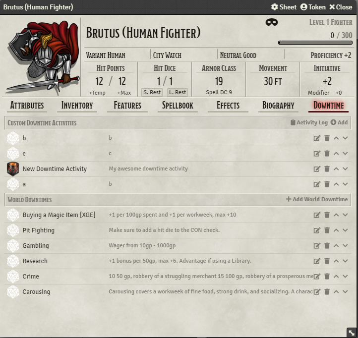
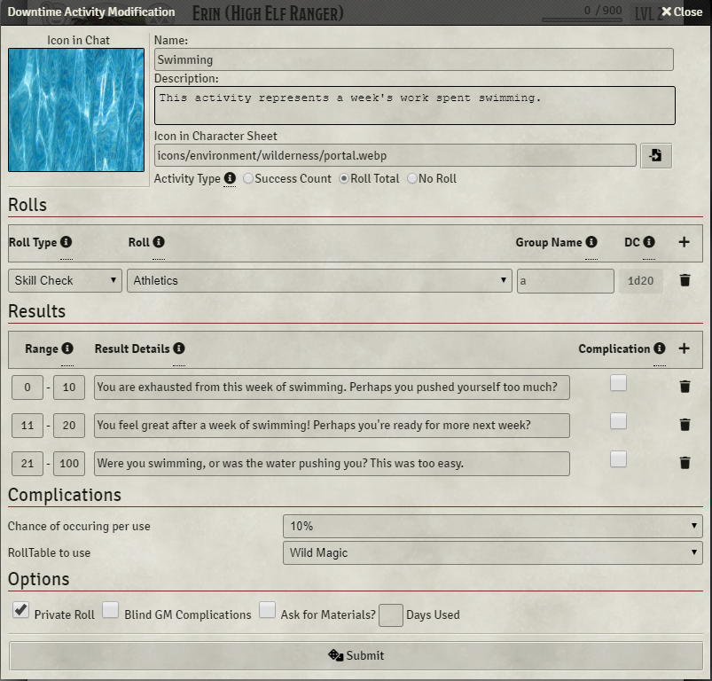
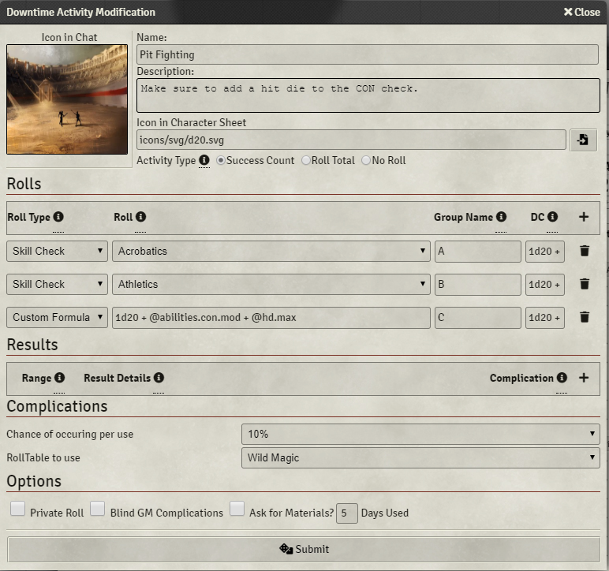
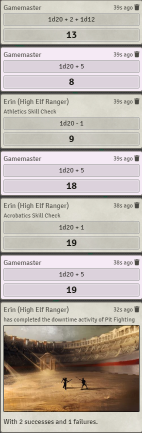

# Ethck's 5e Downtime Tracking


## Summary
Ethck's 5e Downtime Tracking allows you to create a series of rolls with optional predefined DCs that represent
downtime activities as detailed in Xanathar's Guide to Everything (and/or however you desire!).

## Recent Changes
* Numerous Compatibility Fixes for Crash's Tracking & Training, Dice so Nice, Better Rolls 5e, & Skill Customization for 5e!
* Added in Bug Reporter functionality
* Added in Autocomplete Inline Properties (autocomplete for custom attributes!)
* Complete redesign of the entire interface

## How to Use
### Overview



Downtime activities come in two different forms: local and global. Local downtimes are on a per actor
basis and will not be shown in other actor's downtime tabs. Global downtimes will appear in every actor's
downtime tabs. Both types of downtimes can be configured directly in the actor's character sheet.



Adding a downtime is straightforward, you simply just have to fill in all of the blanks! If you want to
add a roll to your downtime, just add a roll and fill in the options as necessary. The DC can be a number, or it can even be a formula, but it is only used for "Success Count" downtimes.. If you want to add a result
that is automatically displayed in chat after the roll, just hit the "Add Result" button and fill in the blanks!
### Types of Downtimes


#### Success Count Downtime
Evaluates each roll comapared to a DC value that is tied to that roll. For instance, if an Athletics check requires a roll of 15 or higher, than only 15 and higher are considered successes. The activity returns the number of successes from all groups of rolls. In this case, if we rolled a 17 the result would be 1 (because 17 > 15).


#### Roll Total Downtime
Roll Total Downtimes do not use DCs, but sum up the result of all rolls to create a single number that is then used to determine the results. Due to this, there is a much greater range of results.


#### No Roll Downtime
No Roll Downtimes do not have a roll or a result, but can still trigger complications and outputs to chat and the audit log that you have completed the task at hand.


### SMART Rolls (New 0.3.2!)
With 0.3.2 I've introduced SMART rolls that can use properties from your character sheet in the rolls.
In order to use these rolls, you MUST use the "Custom Formula" roll type. When entering in your roll,
you will have to use the `@` sign to signal you want to use a property. Below are some common properties.
```
@abilities.str.mod
@attributes.hp.value
@attributes.movement.walk
@attributes.prof
@attributes.spelldc
@currency.gp
@bonsues.mwak
@resources.primary.value
```

and soooo many more.
If you want to find more properties, you can use the following methods:
1) Open the console (usually f12)
2) Select the token whose properties you want to see
3) Type in `_token.actor.data.data` to the console and hit enter.
4) Navigate through the list in the console. All of those are options!


#### Custom Attributes
In addition to everything you can already find in the actor's data, I have added the following properties for your use.

```
hd.max # The largest hit die of the actor's classes
hd.min # The smallest hit die of the actor's classes
```

Please let me know if there are any other attributes you would like to see!

### Using Downtime Activities
In order to roll these downtime activities, just navigate to an actor's character sheet, go in the
downtime tab, and click on the d20 icon next to the downtime activity you wish to do. Just follow
the prompts on the screen, and in no time you'll have completed your downtime activity!





Upon completion of your downtime activity, you'll notice that the rolls are in the chatlog, including
the DC(s) for each of the rolls (only visible to GM by default), and that there is an additional message
showing your completion and its result.


Based off of Crash's 5e Downtime Tracking https://github.com/crash1115/5e-training

How is this module different?

From Crash:
> tldr: [Ethck's] mod automates, [Crash's] tracks.
> 
> very long version:
> 
> ethck's mod focuses more on the implementation of "skill challenge" type downtime activities like the ones you find in xanathar's guide to everything. it lets you construct activities that are made up of multiple rolls, maybe for different skills/abilities/etc that you have to choose between, creating a sort of branching structure with varying dc's for each one. it gives you different outputs depending on how many successes/failures you get and how the activity is configured
> 
> [Crash's] mod is more of a general progress tracking tool. it's a little bit more flexible/less specifically scoped and the activities you can create are nowhere near as complex as his, but it's more useful for tracking things that take multiple days/weeks to complete and things that are less "one and done".

This work is also licensed under the 

[Foundry Virtual Tabletop EULA - Limited License Agreement for Module Development.](https://foundryvtt.com/article/license/)
