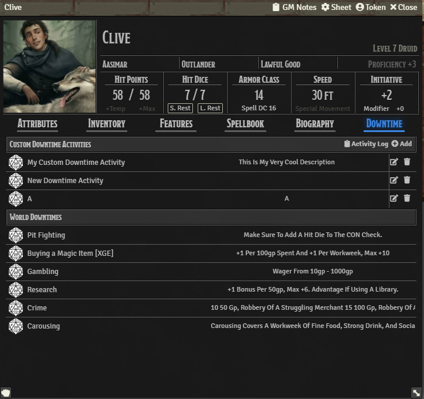

# Ethck's 5e Downtime Tracking

## Summary
Ethck's 5e Downtime Tracking allows you to create a series of rolls with predefined DCs that represent
downtime activities as detailed in Xanathar's Guide to Everything.

## How to Use

Based off of Crash's 5e Downtime Tracking https://github.com/crash1115/5e-training
